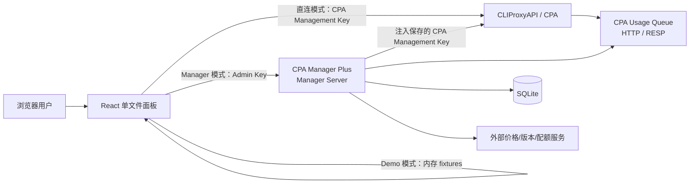
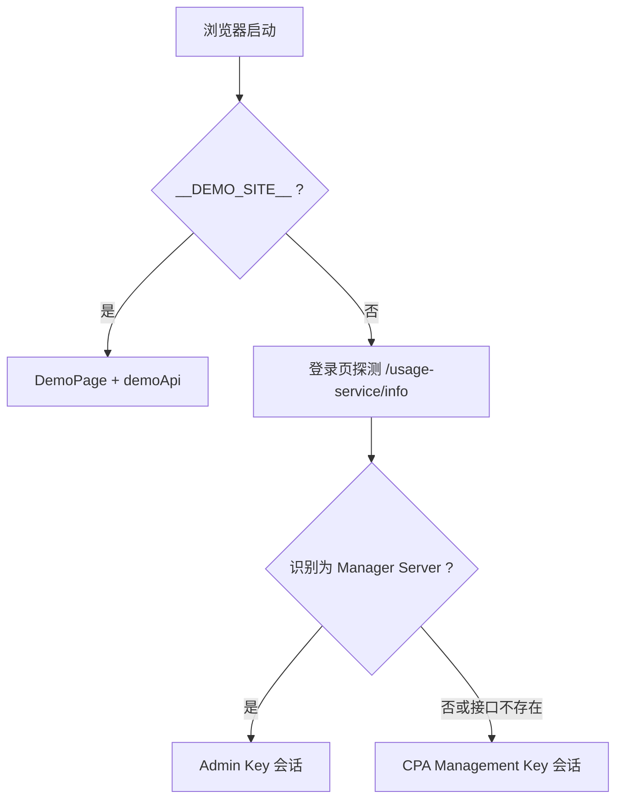
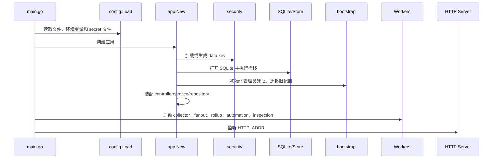

# 02. 架构与运行时

## 2.1 总体架构

## 2.2 三种前端运行形态

### 直连 CPA

- 浏览器以 CPA 地址作为 `apiBase`。
- Axios 请求携带用户输入的 CPA Management Key。
- 配置、认证文件、模型和插件接口由 CPA 直接处理。
- Manager Server 专属的历史使用量、自动化和巡检能力不可用或降级。

### Manager Server 内嵌面板

- 浏览器加载 Manager Server 的 `/management.html`。
- 浏览器使用 Manager Server 管理员 Key。
- Manager Server 自有接口在本地处理。
- 其余 CPA Management API 由 Manager Server 转发，并替换为服务端保存的 CPA Management Key。
- 浏览器不需要知道 CPA Management Key，但“记住密码”仍会保存 Manager Server 管理员 Key。

### Demo

- 构建条件由 [apps/web/vite.config.ts](../../apps/web/vite.config.ts) 中的 `mode=demo`、`DEMO_SITE` 或 `VITE_DEMO_SITE` 决定。
- 路由只暴露 `/demo/*`，见 [appRoutes.tsx](../../apps/web/src/app/appRoutes.tsx)。
- API 由 [demoApi.ts](../../apps/web/src/features/demo/demoApi.ts) 和 `demoFixtures` 响应。
- 生产构建将 `demoFixtures` alias 到空实现，发布前由 `npm run check:demo-isolation` 检查隔离。

## 2.3 单文件面板构建与嵌入

1. Vite 使用 `vite-plugin-singlefile` 生成 `apps/web/dist/index.html`。
2. Docker 构建把该文件复制为 `apps/manager-server/internal/httpapi/web/management.html`。
3. Go 通过 `//go:embed web/management.html` 嵌入二进制。
4. `/management.html` 优先读取配置的外部 `PANEL_PATH`，没有则返回嵌入内容。
5. `/` 临时重定向到 `/management.html`。

相关文件：

- [apps/web/vite.config.ts](../../apps/web/vite.config.ts)
- [Dockerfile.manager-server](../../Dockerfile.manager-server)
- [apps/manager-server/internal/httpapi/server.go](../../apps/manager-server/internal/httpapi/server.go)
- [apps/manager-server/internal/service/panel/service.go](../../apps/manager-server/internal/service/panel/service.go)

这一链路是原生包和容器部署的共同基础，重构前端入口时必须持续验证单 HTML 可运行。

## 2.4 Manager Server 启动链

### 配置来源

进程级配置由 [config.go](../../apps/manager-server/internal/config/config.go) 读取：

1. 环境变量或 secret 文件。
2. `CPA_MANAGER_CONFIG` 指向的 JSON。
3. 可执行文件同目录 `config.json`。
4. 代码默认值。

业务连接配置的有效优先级为：

1. 环境变量 `CPA_UPSTREAM_URL` + `CPA_MANAGEMENT_KEY`；
2. SQLite `settings` 中的 `manager_config_v1`；
3. 旧 `settings.setup`；
4. 未配置状态。

环境变量用于强制覆盖部署配置，Web 修改不能覆盖这些受控字段。旧 `setup` 仍在 bootstrap 阶段迁移和兼容保存。

### 启动生成的安全材料

- 未提供管理员 Key 且数据库无凭证时，生成 `cpamp_` 前缀管理员 Key。
- 未提供数据密钥时，在 `DataKeyPath` 生成 32 字节 key，默认是数据库旁的 `data.key`。
- 管理员 Key 只保存摘要；CPA Management Key 等设置密钥使用 AES-GCM 保存。

当前完整管理员 Key 会在首次生成时打印到日志，这是安全整改重点，见 [08-security-and-open-source-risk-audit.md](08-security-and-open-source-risk-audit.md)。

## 2.5 HTTP 路由优先级

[router.go](../../apps/manager-server/internal/http/router/router.go) 按以下顺序匹配：

1. 独立入口：健康、状态、服务配置、自动化策略、冷却记录、初始化和面板。
2. Manager Server 自有 `/v0/management/model-prices*`。
3. API Key aliases。
4. 账号动作候选。
5. Codex inspection。
6. Dashboard。
7. Monitoring。
8. Usage。
9. 剩余 `/v0/management/*` 代理到 CPA。
10. `/v1/models`、`/models` 和插件资源代理。

因此新增自有 Management API 必须在通用代理之前注册，否则请求会被发送给 CPA。

## 2.6 双认证模型

| 场景 | 浏览器发送 | Manager Server 验证 | 发往 CPA |
| --- | --- | --- | --- |
| 直连 CPA | CPA Management Key | 不经过 Manager Server | 原 Key |
| Manager 自有接口 | Admin Key | `AdminAuthService` | 不发往 CPA |
| Manager 代理 CPA | Admin Key | `AdminAuthService` | 替换为保存的 CPA Management Key |
| 首次未配置探测 | 通常无 Key | 部分状态接口允许有限访问 | 不发往 CPA |

该模型能避免 CPA Key 直接暴露给普通浏览器会话，但前提是管理员 Key、Manager Server 主机和数据卷受到同等保护。

## 2.7 后台 worker

Manager Server 的异步职责包括：

- 采集使用量队列；
- 将新增事件 fanout 给多个消费者；
- 生成账号/模型 rollup；
- 生成 dashboard 小时 rollup；
- 根据限额自动禁用并在到期后恢复；
- 生成账号动作候选；
- 执行 Codex 定时巡检。

worker 依赖同一 SQLite 数据库和 CPA 配置。发布或停机时应优雅停止，避免在批次中断时造成短暂重复；重复事件仍会由 `event_hash` 唯一约束兜底。

## 2.8 外部网络边界

除 CPA 外，代码还会按功能访问：

- LiteLLM 模型价格源；
- OpenRouter 模型价格源；
- GitHub Releases 和版本信息；
- ChatGPT/Codex usage 或 Provider 模型端点；
- 用户配置的 Provider URL。

这些访问应纳入代理、出站防火墙、超时、TLS 和审计策略。CPA URL 由管理员配置，当前缺少针对私网地址和 DNS 重绑定的明确限制。
