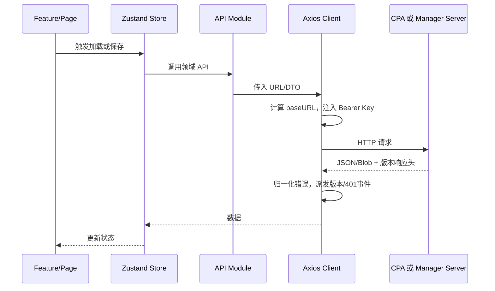
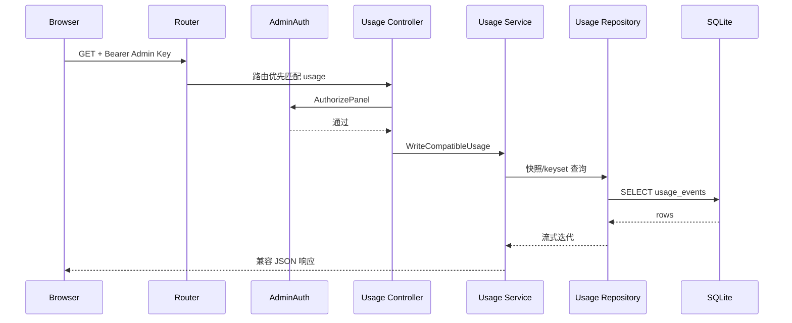
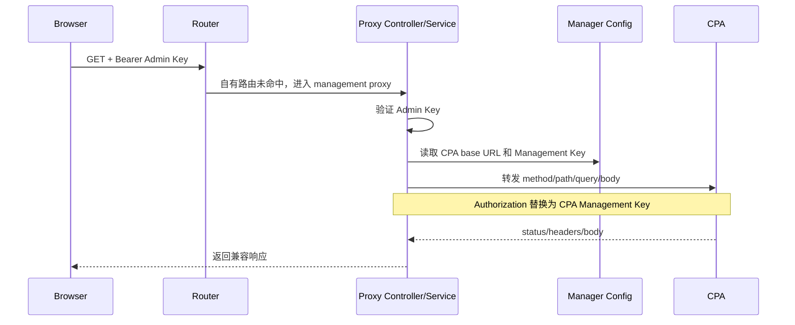
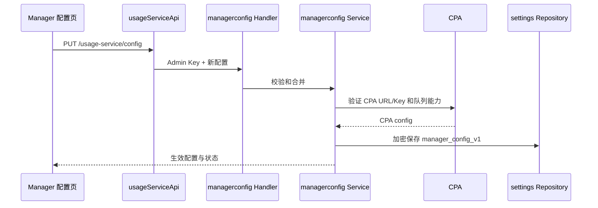
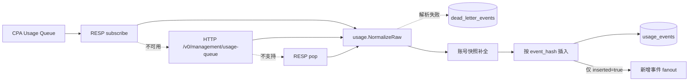
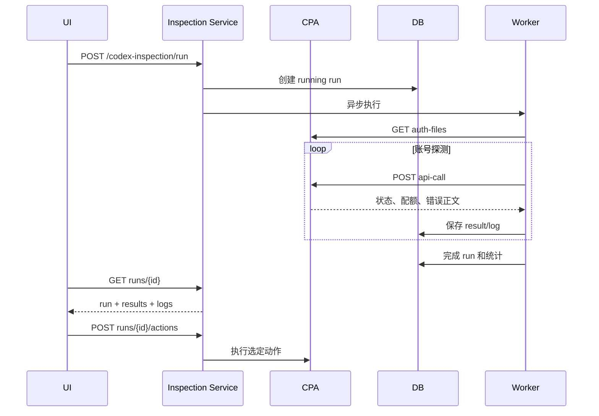

# 03. 接口与调用链

完整接口表见 [api-inventory.md](api-inventory.md)。本章重点说明请求经过哪些模块以及认证如何变化。

## 3.1 前端通用请求链



通用请求实现位于 [client.ts](../../apps/web/src/services/api/client.ts)。使用量与 Manager 专属接口主要集中在 [usageService.ts](../../apps/web/src/services/api/usageService.ts)，该文件也是重构优先级最高的前端服务文件。

## 3.2 登录与后端识别

登录页先对候选地址请求：

```http
GET /usage-service/info
```

- 返回 Manager Server 标识时，进入 Manager 模式，用户输入的是 Admin Key。
- 接口不存在或识别为 CPA 时，进入直连模式，用户输入的是 CPA Management Key。
- Manager 模式登录校验调用 `/usage-service/config`。
- 直连 CPA 登录通过读取 CPA 配置验证 Key。

前端会保存 `sessionMode` 和 `sessionPanelBase`，恢复会话时校验当前运行环境，避免把直连 CPA 会话误用到 Manager 面板。

关键源码：

- [features/login/LoginPage.tsx](../../apps/web/src/features/login/LoginPage.tsx)
- [stores/useAuthStore.ts](../../apps/web/src/stores/useAuthStore.ts)
- [services/api/usageService.ts](../../apps/web/src/services/api/usageService.ts)

## 3.3 Manager 自有接口链

以 `GET /v0/management/usage` 为例：



共同特征：

- controller 首先调用 `middleware.AuthorizePanel`。
- controller 负责 HTTP method、参数、状态码和 JSON。
- service 负责业务规则和跨 repository/CPA 协作。
- repository 负责 SQL、事务、幂等和聚合查询。

## 3.4 CPA 管理接口代理链

以 `GET /v0/management/auth-files` 为例：



代理保留请求方法、路径、查询和大部分响应信息，但认证头由服务端重建。相关实现见：

- [http/controller/proxy/handler.go](../../apps/manager-server/internal/http/controller/proxy/handler.go)
- [service/proxy/service.go](../../apps/manager-server/internal/service/proxy/service.go)

除通用 `/v0/management/*` 外，还代理：

- `/v1/models` 和 `/models`；
- `/v0/resource/plugins/*`；
- 插件声明的管理扩展路径。

## 3.5 Manager 配置保存链



注意事项：

- 环境变量控制的值不能被 Web 持久配置覆盖。
- CPA URL 会归一化，末尾 `/v0/management` 会被移除。
- 采集间隔必须小于或等于 CPA queue retention。
- `collectorMode` 允许 `auto`、`http`、`resp`、`subscribe`。

## 3.6 使用量采集链

采集不由浏览器触发，而由后台 collector worker 持续执行：



实现位置：

- [collector/collector.go](../../apps/manager-server/internal/collector/collector.go)
- [worker/collector_worker.go](../../apps/manager-server/internal/worker/collector_worker.go)
- [httpqueue/client.go](../../apps/manager-server/internal/httpqueue/client.go)
- [resp/client.go](../../apps/manager-server/internal/resp/client.go)
- [usage/event.go](../../apps/manager-server/internal/usage/event.go)

## 3.7 使用量导入与导出

### 导出

`GET /v0/management/usage/export`

- 输出 `application/x-ndjson`。
- 使用快照上界和 keyset 分页，避免一次加载全部事件。
- 输出已脱敏 `raw_json` 和失败摘要。
- 不导出 `fail_body`。

### 导入

`POST /v0/management/usage/import`

- 请求体最大 64 MiB。
- 支持兼容 JSON/JSONL 结构。
- 每批最多 256 个事件写入。
- `event_hash` 重复计为 skipped。
- 解析错误与持久化错误使用不同响应语义。

## 3.8 监控分析链

`POST /v0/management/monitoring/analytics` 接收时间范围、过滤器和 `include`，由 monitoring service 编排：

1. 校验 `from_ms < to_ms`。
2. 按请求决定是否加载汇总、时间序列、维度、事件页和延迟信息。
3. repository 使用原始事件或 rollup 查询。
4. service 转换为前端兼容 DTO。

账号历史和响应头快照使用独立接口：

- `POST /v0/management/monitoring/account-history`
- `GET /v0/management/monitoring/header-snapshots`

当前 [monitoring/service.go](../../apps/manager-server/internal/service/monitoring/service.go) 同时承担过多查询编排与转换职责，建议按 use case 拆分。

## 3.9 自动禁用与恢复链

当新事件包含明确的限额错误和恢复时间：

1. fanout 将事件送到 quota auto-disable consumer。
2. 读取认证文件并确认文件身份。
3. 调用 CPA `PATCH /v0/management/auth-files/status` 禁用。
4. 创建 `quota_cooldowns`，owner 标记为 CPAMP。
5. 恢复 worker 到期后重新读取文件。
6. 只有文件身份、原状态和 owner 均符合预期才恢复。
7. 冲突或人工修改会进入 skipped/error，而不是盲目启用。

关键实现见 [rate_limit_auto_disable.go](../../apps/manager-server/internal/worker/rate_limit_auto_disable.go) 和 [repository/quotacooldown](../../apps/manager-server/internal/repository/quotacooldown/repository.go)。

## 3.10 Codex 巡检链



巡检同时具备自动执行与人工动作语义，重构时应显式建模状态机，避免把“探测结果”“建议动作”“已执行动作”混为一个字段。
