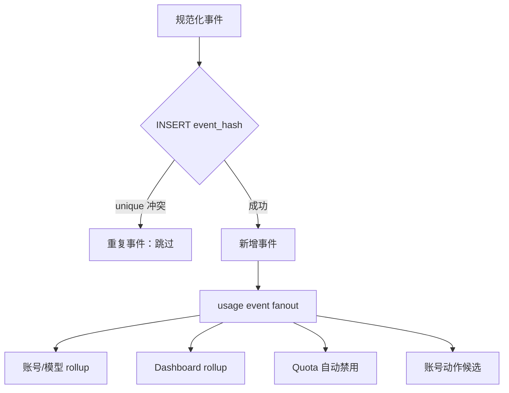

# 04. 核心模块与数据流

## 4.1 前端核心模块

### 应用壳与路由

- [main.tsx](../../apps/web/src/main.tsx) 挂载 React。
- [AppRouter.tsx](../../apps/web/src/app/AppRouter.tsx) 创建 Hash Router。
- [appRoutes.tsx](../../apps/web/src/app/appRoutes.tsx) 在生产和 Demo 路由树之间切换。
- [ProtectedRoute.tsx](../../apps/web/src/router/ProtectedRoute.tsx) 恢复会话并保护主界面。
- [MainLayout.tsx](../../apps/web/src/components/layout/MainLayout.tsx) 负责主导航、能力检测、插件菜单和响应式布局。

使用 Hash Router 是单文件面板的重要兼容策略：浏览器刷新不会要求静态服务器理解前端子路径。

### 认证状态

[useAuthStore.ts](../../apps/web/src/stores/useAuthStore.ts) 负责：

- 保存 `apiBase`、`managementKey` 和运行模式；
- 登录时选择 Manager Server 或 CPA 验证路径；
- 配置 Axios 单例；
- 在 401、后端切换或登出时清理相关缓存；
- “记住密码”时持久化 Key。

该 store 同时包含旧 localStorage 键迁移逻辑。重构持久化格式时必须保留版本迁移，否则现有用户会被静默登出或连接到错误后端。

### API 层

[client.ts](../../apps/web/src/services/api/client.ts) 是 CPA 通用 Axios 单例，职责包括：

- 计算 API base URL；
- 注入 `Authorization: Bearer ...`；
- 兼容 Gemini 旧路径；
- 解析版本和插件支持响应头；
- 将 Axios 错误转为统一 `ApiError`；
- 在 Demo 模式转交给内存 API。

[usageService.ts](../../apps/web/src/services/api/usageService.ts) 则包含 Manager Server 专属 DTO、兼容解析、请求函数和 Demo 分支。建议拆成独立领域模块，见重构蓝图。

### 页面与 feature

`src/pages` 多数为 feature 的路由适配层，实际实现位于 `src/features`。新增业务应延续这一方向：

```text
pages/UsageAnalyticsPage.tsx
  -> features/usage-analytics/UsageAnalyticsPage.tsx
     -> services/api/usage/*
     -> stores / hooks / components
```

不要从 feature 导入 page；仓库级架构测试会阻止这一依赖方向。

## 4.2 后端应用装配

[app.New](../../apps/manager-server/internal/app/app.go) 完成以下工作：

1. 加载或创建数据密钥。
2. 创建 AES-GCM protector。
3. 打开 SQLite 并执行迁移。
4. bootstrap 管理员凭证和旧配置。
5. 创建 collector manager。
6. 通过应用上下文装配 repositories、services 和 controllers。

`app.Context` 是当前依赖容器。它简化了 handler 构造，但也让 service 间依赖容易扩张。重构时可以保留显式 struct 依赖，逐步减少“从全局 Context 任取服务”的模式。

## 4.3 Collector 模式与自动回退

支持模式：

| 配置值 | 行为 |
| --- | --- |
| `auto` | 按 subscribe、HTTP、RESP pop 自动探测和回退 |
| `subscribe` | 使用 RESP pub/sub 持续接收 |
| `http` | 轮询 CPA `/v0/management/usage-queue` |
| `resp` | 使用 RESP list pop |

自动模式的兼容顺序是：

```text
RESP subscribe
  -> 失败或协议不支持
HTTP /v0/management/usage-queue
  -> CPA 不支持该接口
RESP pop
```

该顺序兼容不同 CPA 版本和不同队列暴露方式。不能仅因某一种模式更易维护就删除另外两种。

采集状态会记录 transport、最后错误、最后事件时间等信息，并通过 `/status` 或服务信息暴露给前端。

## 4.4 使用事件规范化

入口为 [usage.NormalizeRaw](../../apps/manager-server/internal/usage/event.go)：

1. 将原始 JSON 解析为通用结构。
2. 兼容 snake_case、camelCase 和历史字段。
3. 识别控制消息，避免将队列控制帧当作请求。
4. 提取请求 ID、模型、Provider、认证索引、来源和 endpoint。
5. 统一 input/output/reasoning/cache token。
6. 解析 latency、TTFT、失败状态、限额响应头和 trace ID。
7. 生成失败摘要和脱敏 `raw_json`。
8. 计算或保留 `event_hash`。

### 失败路径

- JSON 无法解析或事件缺少必要结构时，写入 `dead_letter_events`。
- dead letter 保留原始 payload 和错误，便于恢复兼容，但也是敏感数据风险。
- 数据库写入错误与解析错误必须区分，前者可能需要重试，后者需要解析器升级或人工处理。

## 4.5 账号快照补全

使用事件中的 `auth_index`、账号或文件信息可能不完整。collector 会读取 CPA 认证文件快照，并在写入前补全：

- `account_snapshot`
- `auth_label_snapshot`
- `auth_file_snapshot`
- `auth_provider_snapshot`
- `auth_project_id_snapshot`
- `auth_snapshot_at_ms`

保存快照的原因是认证文件未来可能被重命名、删除或重新授权。如果查询时只关联当前 CPA 状态，历史统计会发生漂移。

快照不是强一致外键：CPA 是外部系统，SQLite 保存的是采集时事实。因此重构数据模型时不应强行把它转换为必须存在的本地账号表外键。

## 4.6 幂等写入与 fanout

`usage_events.event_hash` 具有唯一约束。事件保存应返回“是否真正插入”：



只对新增事件 fanout 至关重要。如果重复事件继续进入自动化，会重复禁用账号、重复增加候选 hit count 或污染 rollup。

## 4.7 Rollup

### 账号/模型 rollup

`usage_account_model_rollups` 按以下主键聚合：

```text
(account_key, billing_model, service_tier)
```

保存调用数、成功/失败、各类 token、长上下文 token 和首次/最后出现时间。主要用于账号历史和模型成本分析。

### Dashboard 小时 rollup

`usage_dashboard_hourly_rollups` 按：

```text
(bucket_ms, model, billing_model, service_tier)
```

聚合调用、token、延迟样本和零 token 请求。Dashboard 可以组合历史 rollup 与近期原始事件，避免每次扫描全量数据。

### checkpoint

`usage_rollup_checkpoints` 保存每个 rollup consumer 的最后事件 ID、运行时间和错误。重建 rollup 时需要同步清空对应 checkpoint，否则 worker 会认为历史已处理。

## 4.8 模型价格与成本

价格来源包括：

- 用户手工保存；
- LiteLLM 同步；
- OpenRouter 同步；
- 已保存价格与远端价格的合并。

每条价格区分 prompt、completion、cache read、cache creation，并保留“是否明确配置”的标志，避免把未提供字段的零值误认为真实免费价格。

成本计算根据 billing model、service tier 和 token 类型执行。模型别名和 Provider 返回名可能不同，必须继续保留 requested/resolved/billing model 的转换链。

## 4.9 账号动作候选

`account_action_candidates` 表示系统识别到但未必自动执行的账号处理建议。

典型状态：

- `pending`：等待人工处理；
- `ignored`：人工忽略；
- `resolved`：确认已处理；
- 其他动作执行结果由 service 更新。

候选身份由认证文件、动作类型、认证索引和账号 ID 共同约束。只使用文件名会把一个文件内的不同账号错误合并。

操作接口包括 ignore、resolve、enable 和删除认证文件。删除属于破坏性操作，应保留服务端冲突检查和前端明确确认。

## 4.10 配额冷却所有权

自动禁用不是简单的“到时间就启用”。`quota_cooldowns` 保存：

- 认证文件和认证索引；
- 账号、Provider 和触发事件；
- 恢复时间；
- owner；
- 自动禁用前状态；
- 当前状态和最后错误。

恢复前应确认：

1. 当前文件仍是同一身份；
2. cooldown 仍是 active；
3. owner 是 CPAMP；
4. 账号禁用状态与系统此前动作一致；
5. 没有明显人工覆盖。

这是避免系统覆盖管理员手工决策的核心安全机制。

## 4.11 Codex 巡检状态

巡检由三类数据构成：

- `codex_inspection_runs`：一次批量任务及其统计。
- `codex_inspection_results`：每个账号的探测、建议和动作结果。
- `codex_inspection_logs`：运行日志与结构化 detail。

当前 service 同时负责：

- 选择认证文件；
- 并发探测；
- 解析 usage 响应；
- 判断动作；
- 自动/人工执行动作；
- 保存日志和状态。

建议将其拆成 selector、probe、decision、executor 和 run orchestrator，状态转换使用明确枚举和单元测试。

## 4.12 配置与加密存储

SQLite `settings` 保存 JSON 配置。敏感字段由 setting repository 调用 protector 保护：

```text
原始 data key
 -> HKDF("settings-secrets-v1")
 -> AES-GCM
 -> enc:v1:<nonce>:<ciphertext>
```

该设计可以防止“只拿到 SQLite 文件”时直接读取 CPA Management Key。但默认 `data.key` 与 `usage.sqlite` 位于同一数据目录，整个数据卷泄露时无法形成独立保护。
