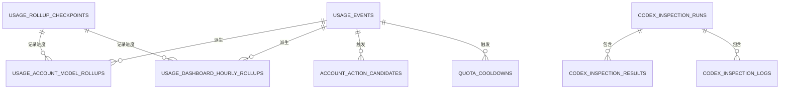

# 05. 数据模型与存储

## 5.1 SQLite 运行参数

[migrate.go](../../apps/manager-server/internal/repository/sqlite/migrate.go) 在启动时设置：

```sql
pragma journal_mode = WAL;
pragma synchronous = FULL;
pragma busy_timeout = 5000;
pragma foreign_keys = ON;
```

含义：

- WAL 允许读写更好地并发，但备份时不能只随意复制主数据库文件。
- `synchronous=FULL` 优先保证持久性。
- busy timeout 缓解短时写锁冲突。
- 巡检表通过外键级联删除结果和日志。

## 5.2 表清单

当前迁移定义 13 张核心表：

| 表 | 作用 | 主要写入方 |
| --- | --- | --- |
| `usage_events` | 规范化使用事件事实表 | collector、import |
| `usage_rollup_checkpoints` | rollup 消费进度与错误 | rollup workers |
| `usage_account_model_rollups` | 账号/模型累计统计 | account history rollup |
| `usage_dashboard_hourly_rollups` | Dashboard 小时统计 | dashboard rollup |
| `dead_letter_events` | 无法解析的原始事件 | collector |
| `settings` | 管理配置、凭证摘要、bootstrap 状态 | bootstrap/config services |
| `model_prices` | 模型价格和同步来源 | model price service |
| `api_key_aliases` | API Key hash 到显示别名 | alias service |
| `account_action_candidates` | 账号处理候选 | fanout worker/service |
| `codex_inspection_runs` | 巡检任务 | inspection service |
| `codex_inspection_results` | 账号巡检结果 | inspection service |
| `codex_inspection_logs` | 巡检日志 | inspection service |
| `quota_cooldowns` | 自动禁用与恢复所有权 | quota worker |

## 5.3 关系图



rollup、候选和 cooldown 多数没有数据库外键指向 `usage_events`，而是通过 event hash、账号身份或业务规则关联。这是为了允许数据导入、清理和外部 CPA 状态变化。

## 5.4 `usage_events`

### 身份与时间

- `id`：本地递增游标，rollup 使用。
- `request_id`：请求链标识，不保证唯一。
- `event_hash`：跨采集重试幂等键，唯一。
- `timestamp_ms` / `timestamp`：数值和兼容字符串时间。

### 请求维度

- `provider`、`executor_type`
- `model`、`requested_model`、`resolved_model`
- `endpoint`、`method`、`path`
- `reasoning_effort`、`service_tier`

### 认证与账号快照

- `auth_type`、`auth_index`
- `source`、`source_hash`
- `api_key_hash`
- `account_snapshot`
- `auth_label_snapshot`
- `auth_file_snapshot`
- `auth_provider_snapshot`
- `auth_project_id_snapshot`
- `auth_snapshot_at_ms`

### token 与性能

- input、output、reasoning、cached
- cache、cache read、cache creation
- total
- `latency_ms`、`ttft_ms`

### 失败与响应元数据

- `failed`
- `fail_status_code`
- `fail_summary`
- `fail_body`
- `response_metadata_json`
- 限额恢复时间、使用百分比、计划类型
- error kind、error code、trace ID
- `raw_json`

### 敏感性

高风险字段是 `fail_body` 和 `raw_json`。当前 `raw_json` 会经过脱敏，导出不包含 `fail_body`，但数据库内的 `fail_body` 可能保存上游原始错误正文。

## 5.5 `dead_letter_events`

字段仅有：

- `payload`
- `error`
- `created_at_ms`

设计优点是能够在解析器修复后重放；风险是原始 payload 没有统一脱敏。应增加：

- 最大长度；
- 保留期限；
- 可配置禁用；
- 写入前通用秘密扫描；
- 管理端查看时二次脱敏。

## 5.6 Rollup 表

### 账号/模型

主键：

```sql
primary key (account_key, billing_model, service_tier)
```

它是累计表，不按时间桶拆分。账号历史查询若需要精细时间序列，仍可能读取原始事件或其他聚合逻辑。

### Dashboard 小时

主键：

```sql
primary key (bucket_ms, model, billing_model, service_tier)
```

`bucket_ms` 是小时桶起点。保存 `latency_sum_ms` 和 `latency_samples`，可以计算均值，但不能直接恢复任意分位数。

### 长上下文字段迁移

迁移检测到 rollup 缺少 long-context token 字段时，会：

1. 新增列；
2. 清空两个 rollup 表；
3. 删除相关 checkpoint；
4. 由 worker 从事实表重建。

这是正确的派生数据迁移模式。不要试图用不完整旧 rollup 推导新字段。

## 5.7 `settings`

`settings` 是通用 key/value JSON 表，至少承载：

- 管理员凭证摘要；
- `manager_config_v1`；
- 旧 `setup`；
- bootstrap 状态；
- 自动化设置；
- 其他服务配置。

优点是迁移简单，缺点是缺少数据库层 schema。建议为每个 setting：

- 定义常量 key；
- 定义版本化 DTO；
- 单独实现 validate/migrate；
- 写入时加密明确的 secret 字段；
- 禁止 service 直接写任意 JSON。

## 5.8 `model_prices`

除了单价，还保存：

- 每类价格是否明确配置；
- 来源和来源模型 ID；
- 远端原始 JSON；
- 更新时间和同步时间。

`raw_json` 可能包含外部服务返回的扩展元数据，当前风险低于 usage 原始正文，但仍应限制大小。

## 5.9 账号自动化表

### `account_action_candidates`

pending 唯一索引使用：

```sql
(auth_file_name, action_type, coalesce(auth_index, ''), coalesce(account_id_snapshot, ''))
where status = 'pending'
```

这允许同一候选重复命中时更新 `hit_count` 和最后出现时间，而不是插入多条 pending。

### `quota_cooldowns`

active owner 唯一索引：

```sql
(auth_file_name, owner) where status = 'active'
```

同一 owner 对同一文件不能同时持有多条 active cooldown。恢复状态包括 recovered、skipped 和错误信息。

## 5.10 巡检表

`codex_inspection_results` 与 `codex_inspection_logs` 使用 `run_id` 外键，删除 run 会级联删除明细。

敏感字段：

- `error_detail`：可能包含上游响应正文；
- `detail_json`：取决于调用方传入内容；
- `settings_json`：可能暴露巡检策略和目标信息。

日志 detail 的字段名脱敏不足以覆盖任意 `body` 字段，应统一复用 usage 的递归脱敏器。

## 5.11 迁移策略

当前迁移采用：

- `create table if not exists`；
- `pragma table_info` 检测缺列；
- `alter table add column`；
- 必要时重建派生数据。

后续建议引入显式 `schema_migrations` 表，记录每个迁移版本和执行时间。原因：

- 目前无法直接知道一个数据库经历了哪些迁移；
- 所有检查集中在单个函数，文件会持续膨胀；
- 复杂数据回填难以断点和审计。

迁移原则：

1. 先扩展 schema，再发布读写兼容代码。
2. 后台回填可断点续跑。
3. 旧字段至少跨一个稳定版本保留。
4. 删除字段或表必须先提供导出与回滚方案。
5. 派生表优先重建，不要写不可验证的推导迁移。

## 5.12 备份与恢复

建议使用 SQLite 在线备份 API 或：

```sql
VACUUM INTO 'backup.sqlite';
```

若停机复制，应同时处理主库、`-wal` 和 `-shm`，或先正常关闭进程并确认 WAL 已 checkpoint。

完整恢复至少需要：

- `usage.sqlite` 的一致性备份；
- 对应 `data.key` 或外部 `CPA_MANAGER_DATA_KEY`；
- 部署配置和 secret 来源；
- 当前二进制版本。

只有数据库没有 data key 时，受保护的 CPA Management Key 无法解密；数据库和默认 data key 一起泄露时，加密保护也随之失效。
