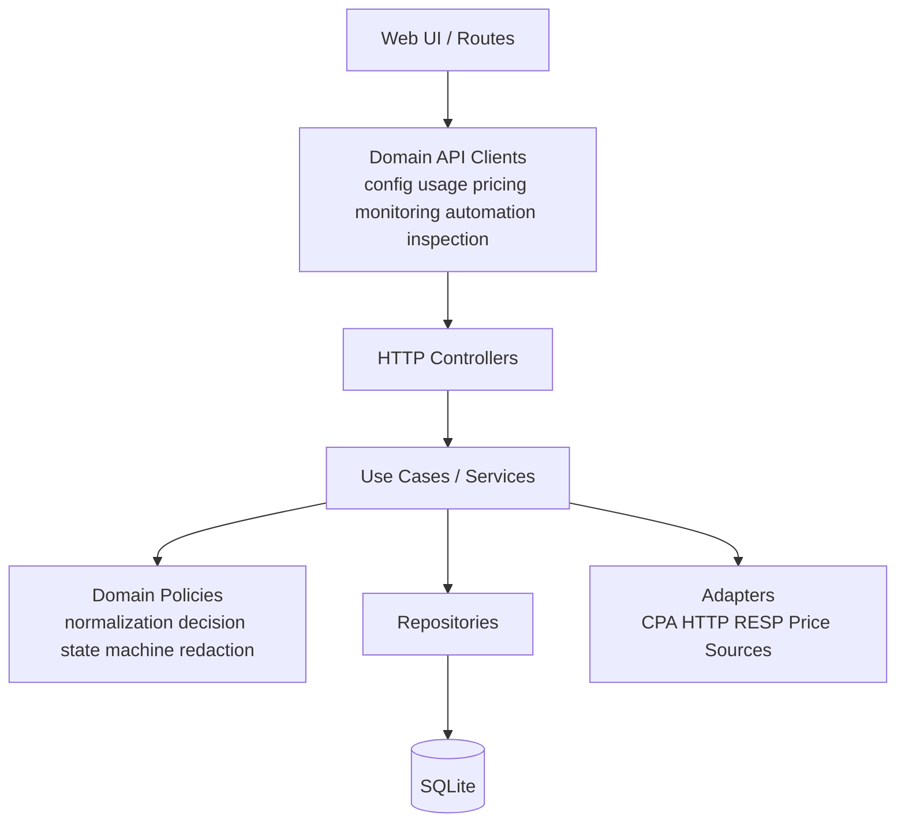

# 06. 重构蓝图

## 6.1 目标

重构目标不是改变产品形态，而是降低以下成本：

- 修改一个功能时需要理解超大文件；
- 前后端 DTO 和兼容字段散落；
- service、repository 和 worker 所有权不清晰；
- 自动化状态转换难以验证；
- 安全策略在多个模块重复且不一致；
- 新接口容易被通用代理抢先匹配。

## 6.2 不可破坏的约束

| 约束 | 原因 | 验证方式 |
| --- | --- | --- |
| 直连 CPA 和 Manager 模式同时可用 | 用户部署形态不同 | 双模式集成测试 |
| Admin Key 与 CPA Key 分离 | 核心安全边界 | 代理认证测试 |
| 自有 management 路由优先于代理 | 同路径扩展模型 | router 表驱动测试 |
| 三协议采集与自动回退 | CPA 版本兼容 | collector fallback 测试 |
| `event_hash` 幂等 | 防重复统计和自动动作 | repository/worker 测试 |
| 旧配置和导入字段兼容 | 已有部署升级 | migration/import fixtures |
| 单文件 `management.html` | CPA 面板、原生包和容器 | production build |
| Demo fixtures 不进入生产 | 防演示数据和体积污染 | demo isolation check |
| `features/components` 不依赖 `pages` | 前端依赖方向 | architecture test |

## 6.3 目标分层



核心原则：

- controller 只处理 HTTP；
- use case 只编排业务；
- domain policy 使用纯函数；
- repository 不调用外部网络；
- adapter 不直接写数据库；
- worker 调用 use case，而不是复制业务逻辑。

## 6.4 前端拆分方案

### 6.4.1 `usageService.ts`

建议拆为：

```text
services/api/manager/
├─ transport.ts             URL、headers、Axios wrapper
├─ serviceInfo.ts           info/status/config
├─ usage/
│  ├─ types.ts
│  ├─ normalize.ts
│  ├─ client.ts
│  └─ importExport.ts
├─ pricing/
│  ├─ types.ts
│  └─ client.ts
├─ monitoring/
│  ├─ types.ts
│  ├─ normalize.ts
│  └─ client.ts
├─ automation/
│  ├─ types.ts
│  └─ client.ts
└─ inspection/
   ├─ types.ts
   ├─ normalize.ts
   └─ client.ts
```

迁移步骤：

1. 先移动纯类型和纯归一化函数，保留旧 export。
2. 为每个新 client 写 contract tests。
3. 旧 `usageServiceApi` 改为组合新模块的 facade。
4. feature 逐个改用新模块。
5. 没有调用方后再删除 facade。

### 6.4.2 Usage Analytics 页面

建议拆成：

- `useUsageAnalyticsQueryState`
- `useUsageAnalyticsData`
- `useUsageImportExport`
- `UsageSummary`
- `UsageFilters`
- `UsageTimeseries`
- `UsageDimensions`
- `UsageEventsTable`
- `UsageEventDetailDrawer`
- `ModelCostPanel`

页面只负责组装和路由级状态。过滤器序列化、查询 DTO、图表 option 和事件列定义应分别测试。

### 6.4.3 Auth Files 页面

按 use case 拆分：

- 列表查询和分页；
- 选择状态；
- enable/disable/delete 批量动作；
- OAuth/reauth；
- 详情抽屉；
- 配额读取；
- UI state 持久化。

破坏性动作统一经过一个 command hook，返回 pending/success/error，避免每个按钮重复处理刷新和通知。

### 6.4.4 MainLayout

拆分为：

- 静态导航定义；
- 后端能力解析；
- 插件菜单适配；
- 桌面侧边栏；
- 移动抽屉；
- 顶栏和用户菜单。

能力检测应输出稳定的 `PanelCapabilities`，布局不直接理解每个后端版本条件。

## 6.5 后端拆分方案

### 6.5.1 Router

当前前缀 if-chain 可继续工作，但新增接口风险较高。建议建立显式路由注册表：

```go
type ManagementRoute struct {
    Prefix  string
    Handler http.Handler
}
```

注册顺序仍然是行为的一部分，应有测试确保所有自有 route 在 proxy 前。

不建议在第一阶段替换 `net/http` 路由库，因为这会扩大兼容回归面。

### 6.5.2 Monitoring service

拆为：

```text
service/monitoring/
├─ analytics.go
├─ account_history.go
├─ header_snapshots.go
├─ dimensions.go
├─ event_page.go
├─ latency.go
├─ request.go
└─ response.go
```

repository 查询也按 use case 暴露，避免一个 service 方法自行拼接多个低层 SQL 细节。

### 6.5.3 Codex inspection

目标组件：

- `RunCoordinator`：创建 run、控制并发、完成/失败。
- `AccountSelector`：筛选待探测账号。
- `ProbeClient`：调用 CPA api-call。
- `DecisionEngine`：纯函数决定建议动作。
- `ActionExecutor`：执行 enable/disable/delete/reauth。
- `RunRepository`：状态、结果和日志。

建议明确状态转换：

```text
pending -> running -> completed
                   -> failed
                   -> cancelled（未来可选）
```

结果动作分为：

```text
recommended_action
execution_status
executed_action
execution_error
```

不要继续依赖多个含义相近的字符串字段隐式表达状态。

### 6.5.4 `store.Store`

当前 `store.Store` 同时：

- 持有 repositories；
- 暴露大量转发方法；
- 为旧测试和 service 提供兼容 API。

渐进方案：

1. 新 service 直接依赖最小 repository interface。
2. 旧 service 保持 `Store`。
3. 每迁移一个域，删除该域无价值的转发方法。
4. `Store` 最终只负责构造、事务边界或兼容入口。

### 6.5.5 Collector 与 fanout

定义统一输入接口：

```go
type RawEventSource interface {
    Receive(ctx context.Context) ([]byte, error)
    Name() string
}
```

auto collector 负责选择 source；标准处理管线只关心 raw bytes。这样可以独立测试：

- transport fallback；
- NormalizeRaw；
- dead letter；
- snapshot enrichment；
- insert result；
- fanout。

fanout consumer 应声明是否要求严格顺序、失败是否重试、是否允许丢弃，避免一个 consumer 阻塞所有后续消费者。

## 6.6 安全基础设施重构

建立共享安全模块：

- `SecretRedactor`：递归处理 header、body、URL、JSON 和文本。
- `OutboundURLPolicy`：协议、host、私网、重定向和 DNS 校验。
- `CredentialHasher`：版本化 Argon2id/scrypt/PBKDF2。
- `SecretStore`：数据密钥来源、轮换和 secret 字段声明。
- `RetentionPolicy`：raw payload、dead letter、inspection detail 的期限。

这些能力应由 service 调用，而不是散落在日志、usage、inspection 和 proxy 中各自实现。

## 6.7 分阶段实施

### 阶段 0：建立保护网

- 固化 API inventory 和兼容契约。
- 增加双后端认证测试。
- 为 collector fallback 增加表驱动测试。
- 为导入旧格式建立 fixtures。
- 为现有大文件记录职责和关键用例。

交付标准：不改变生产行为，所有测试保持通过。

### 阶段 1：纯函数与类型拆分

- 拆前端 DTO/normalize。
- 拆 Go monitoring request/response 和 inspection decision。
- 统一错误码和错误映射。

交付标准：旧 facade 仍可用，页面和 HTTP 输出不变。

### 阶段 2：领域 API 与 use case

- 前端按 config/usage/pricing/monitoring/automation/inspection 拆 client。
- 后端按同样领域拆 service。
- 新代码依赖最小 repository interface。

交付标准：功能按领域可独立测试。

### 阶段 3：worker 与状态机

- collector source 接口化。
- fanout consumer 显式化。
- inspection 和 cooldown 使用状态机。
- 增加幂等、重启和人工覆盖测试。

交付标准：异常重启不会导致重复动作。

### 阶段 4：数据迁移框架

- 新增 `schema_migrations`。
- 为长时间回填增加 checkpoint 和进度。
- 定义 retention 和清理 worker。

交付标准：迁移可观测、可恢复、可回滚。

### 阶段 5：安全整改

- 管理员摘要版本升级。
- 首次 Key 改为一次性文件、终端提示或显式 secret。
- URL policy 和 CORS 默认值收紧。
- 数据密钥外置和轮换。
- 依赖、Action、镜像固定版本。

交付标准：高风险项关闭，旧凭证可平滑升级。

## 6.8 每次重构 PR 的检查

- 是否改变 URL、method、字段名、默认值或状态码？
- 是否同时测试直连 CPA 与 Manager 模式？
- 是否误把 Admin Key 发给 CPA，或把 CPA Key 返回给浏览器？
- 是否破坏 Demo 构建隔离？
- 是否保持单 HTML 构建？
- 是否改变 `event_hash` 或 fanout 语义？
- 是否对旧数据库和旧导入数据可兼容？
- 是否新增持久化敏感正文？
- 是否需要更新 [api-inventory.md](api-inventory.md) 和 [risk-register.md](risk-register.md)？
